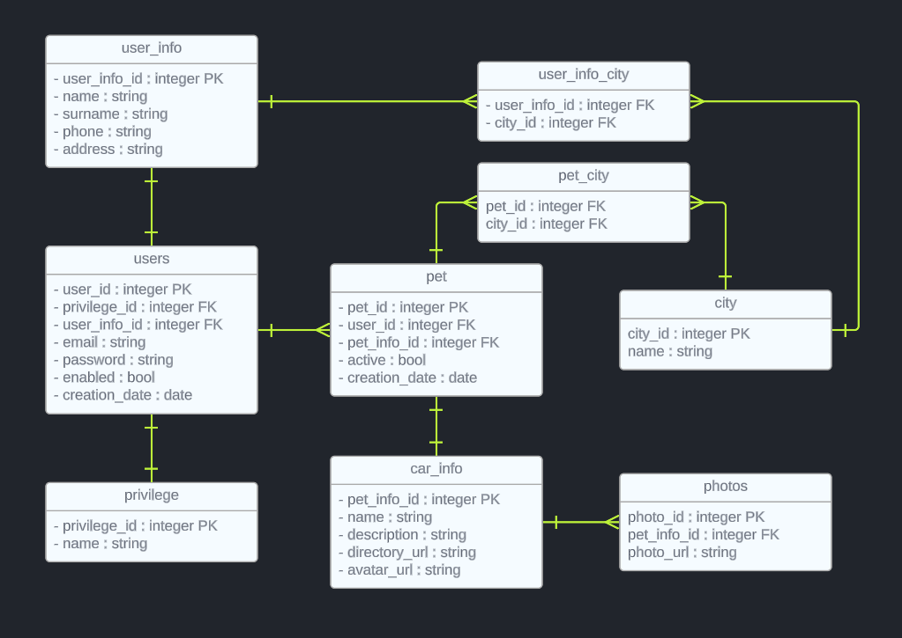
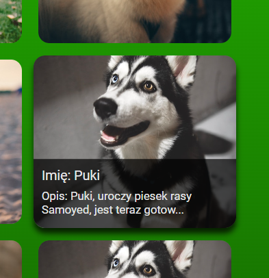

# RedemPAW

## Cel projektu:

Stworzenie aplikacji pozwalającej użytkownikom przeglądaj, jak i tworzyć ogłoszenia odnośnie zwierzaków szukających nowego domu. Aplikacja powstała głównie z myślą o zapewnienie godnego życia dla zwierząt czekających na swoją chwilę w schroniskach.

## FUNKCJONALNOŚCI:

- logowanie
- rejestracja
- wylogowywanie
- przeglądanie aktualnych wpisów
- wyświelenie jednego wpisu
- wyszukanie wpisów w zależności od miasta
- dodanie wpisu

## DIAGRAM UML KLAS:

## DIAGRAM ERD BAZY:

## STRUKTURA FOLDERÓW:

## FIGMA:

[Kliknij tutaj](https://www.figma.com/file/ZoEKdd82jdXUYH6LFsiTPp/Untitled?type=design&node-id=1%3A3&mode=design&t=4QemBiYVh9muGkZP-1)

## PRZYKŁAD DZIAŁANIA:

#### Przy pierwszym wejściu na stronę mamy możliwość zalogowania się, lecz nie mając konta klikamy przycisk zarejestruj.

#### Do rejestracji potrzebujemy użyć email'a którego jeszcze nie ma w bazie danych, oraz haseł które się zgadzają. Jeśli choć jedna z tych rzeczy nie zostanie spełniona, system nas o tym poinformuje tym samym przerwie nasz proces rejestracji. W momencie kiedy wszystko będzie się zgadzało utworzy nasze konto.

#### Po zalogowaniu się ujrzymy wszystkie widoczne wpisy dla miasta, które podaliśmy podczas rejestracji. Na szczęście nie ma obawy, gdyż w każdym momencie możemy ustawić nasz "search-bar" na miasto jakie tylko chcemy. Dodatkowo przy najechaniu na jakikolwiek wpis, zostanie on lekko zwiększony oraz pokaże nam kilka informacji, takich jak imię zwierzaka czy początek opisu.

#### Każdy widok naszej aplikacji jest w 100% responsywny dlatego możemy cieszyć się naszym projektem na urządzeniach stacjonarnych jak i mobilnych.

#### Po wejściu w jakikolwiek wpis jesteśmy w stanie zobaczyć dodatkowe informacje o zwierzaku takie jak: imie, opis, dane kontaktowe właściciela oraz zdjęcia.

#### Po przejściu do podstrony "dodaj zwierzaka" (addpet), znajdującej się w stropce strony, jesteśmy w stanie dodać nowy wpis. Potrzebujemy do tego imię pupila, dokładny opis oraz zdjęcia.

#### Po poprawnym utworzeniu naszego wpisu jesteśmy w stanie podziwiać jego rezultat.

## Rozwój projektu:

### Na sam rozwój projektu jest niezliczona ilość pomysłów, oto niektóre z nich:

- dodanie profili użytkownika
- dodanie możliwości moderowania treścią
- dodanie wbudowanego komunikatora między użytkowniami
- dodanie możliwości ustawiania pineski na mapie
- dodanie ustawiania wizyt / rezerwowania zwierzaka
